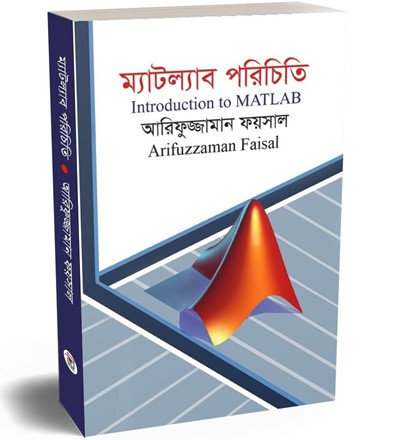

# MATLAB Book for BSc Students in Bengali

বিজ্ঞানের যে কোন শাখায় বিএসসি অথবা ইঞ্জিনিয়ারিং পড়া থেকে শুরু করে উচ্চতর পড়াশোনা, গবেষণায় ব্যাপক ভাবে ব্যবহৃত একটি সফটওয়্যার ম্যাটল্যাব। ম্যাটল্যাব একটি উচ্চ স্তরের প্রোগ্রামিং ভাষা, যেখানে গণনা, প্রোগ্রাম করা, সিমুলেশোন, ভিজুয়ালাইজেশনের মতো নানান কাজ খুব সহজে করা যায়। পদার্থ বিজ্ঞান, গনিত, রসায়ন, জীববিজ্ঞানসহ যে কোন ইঞ্জিনিয়ারিং বিষয় যেমন, তড়িৎ কৌশল, কেমি কৌশল, যন্ত্র কৌশল, পুর কৌশল সহ আরো অনেক বিষয়ে অধ্যয়নের জন্য ম্যাটল্যাব শিক্ষা অনেকটা বাঞ্ছনীয় হয়ে দাঁড়িয়েছে। আমি যখন ম্যাটল্যাবে কোড করি, আমার কাছে মনে হয়েছে খুব সফজ একটি বই থাকলে অনেক সহজেই শিখতে পারা যেতো। সেই চিন্তা থেকেই বইটি লেখা। যেহেতু ম্যাটল্যাবের বিষয় বস্তু সমূহ অনেক বড় পরিসরে ব্যাপ্ত, তাই বইটিতে সকল টপিক এমন ভাবে সাজানো হয়েছে, যাতে বইটি পড়ার পর ম্যাটল্যাব সম্পর্কে সুস্পষ্ট ধারণা পাওয়া যায় এবং যে কোন কোড সহজে অনুধাবন করা যায়। 
অনেকেই বিশব্বিদ্যালয়ে প্রোগ্রামিং শেখার জন্য সহায়ক বই হিসেবে একটি সহজ এবং সংক্ষিপ্ত বইয়ের খোঁজ করে। সেই সকল মেধাবী শিক্ষার্থীদের জন্য আমার ম্যাটল্যাব পরিচিতি বইটি আরো কিছুটা পরিমার্জিত করে, নতুন আরো কিছু টপিক সংযুক্ত করে গবেষণায় ম্যাটল্যাব বইটি অনলাইনে সবার জন্য ফ্রি করে দিলাম।
পরিশেষে যে কোনো ধরণের উপদেশ বা বইয়ে কোন ভুল ত্রুটি জানালে কৃতজ্ঞ থাকবো।

মোঃ আরিফুজ্জামান ফয়সাল,
তড়িৎ ও কম্পিউটার প্রকৌশলে পিএইচডিতে অধ্যয়নরত। 
ডিসেম্বর, ২০২৩

For the latest version of this book, please visit the following link. The content is continuously updated based on reader comments and suggestions:

[Link to the Latest Version](https://drive.google.com/file/d/1D_yMA6K3RXpUPsa8IFbt-kDT7mVeKW-R/preview)

This ongoing work is dedicated to providing comprehensive and valuable MATLAB insights for BSc students. Your feedback is highly appreciated, and we strive to enhance the content based on the evolving needs of our readers.

